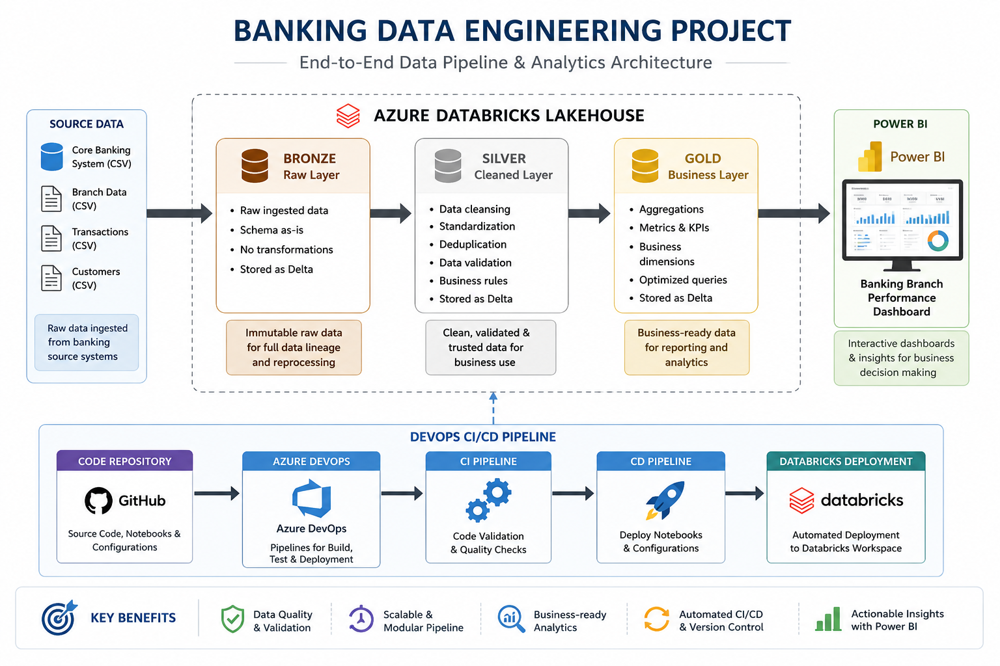
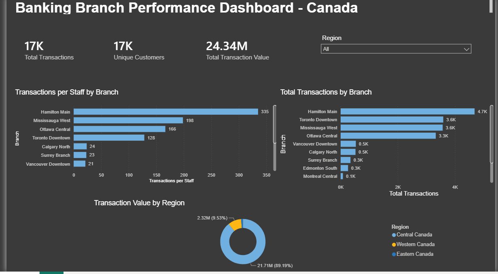

# Banking Data Engineering Pipeline

## Project Overview

This project demonstrates an end-to-end banking data engineering pipeline built using Azure Databricks and PySpark.

The solution follows the Medallion Architecture (Bronze, Silver, and Gold) to progressively ingest, clean, transform, validate, and aggregate banking transaction data.

The project also demonstrates Git-based version control and an Azure DevOps CI/CD pipeline for automated deployment of Databricks notebooks.

---

## Architecture
### Solution Architecture

The following architecture illustrates the end-to-end flow of the banking data engineering solution, from source ingestion through the Medallion Architecture to Power BI analytics, along with the CI/CD deployment workflow.



```text
Banking Source Data
        |
        v
+-------------------+
|   Bronze Layer    |
|   Raw Ingestion   |
+-------------------+
        |
        v
+-------------------+
|   Silver Layer    |
| Clean & Transform |
| Data Validation   |
+-------------------+
        |
        v
+-------------------+
|    Gold Layer     |
| Business Metrics  |
|   Aggregations    |
+-------------------+
        |
        v
 Analytics / Reporting
```

---

## Technology Stack

- Azure Databricks
- Apache Spark / PySpark
- Spark SQL
- Delta Lake
- Unity Catalog
- Azure DevOps
- Git / GitHub
- Azure DevOps Pipelines
- Databricks CLI
- YAML

---

## Medallion Architecture

### Bronze Layer

The Bronze layer represents the raw ingestion stage of the pipeline.

Responsibilities include:

- Ingesting source banking data
- Preserving raw data for traceability
- Creating the foundation for downstream transformations

Notebook:

`notebooks/bronze/01_bronze_ingestion`

---

### Silver Layer

The Silver layer transforms raw Bronze data into cleaned and validated datasets.

Key processing includes:

- Data cleansing
- Standardization
- Data type validation
- Duplicate handling
- Business-rule transformations
- Data quality checks
- Joining transaction and reference data

Notebook:

`notebooks/silver/02_bronze_to_silver`

---

### Gold Layer

The Gold layer creates business-ready datasets from validated Silver data.

This layer is designed for downstream analytics and reporting by applying business transformations and aggregations.

Notebook:

`notebooks/gold/03_silver_to_gold`

---

## Data Engineering Flow

```text
Bronze
  |
  | Raw banking transactions
  v
Silver
  |
  | Cleaned + validated + enriched data
  v
Gold
  |
  | Business-ready aggregated datasets
  v
Analytics
```

---

## CI/CD Pipeline

The repository includes an Azure DevOps CI/CD pipeline defined in:

`azure-pipelines.yml`

The pipeline demonstrates automated deployment of Databricks notebooks.

### CI/CD Workflow

```text
Developer Changes
       |
       v
Feature Branch
       |
       v
Pull Request
       |
       v
Main Branch
       |
       v
Azure DevOps Pipeline
       |
       v
Databricks CLI
       |
       v
Azure Databricks Workspace
```

The pipeline:

1. Checks out the source code.
2. Installs the Databricks CLI.
3. Authenticates to the Databricks workspace using pipeline variables.
4. Deploys the project notebooks to Databricks.

Sensitive authentication values are maintained outside the repository using secured pipeline variables.

---

## Repository Structure

```text
Banking-Data-Engineering/
│
├── notebooks/
│   ├── bronze/
│   │   └── 01_bronze_ingestion
│   │
│   ├── silver/
│   │   └── 02_bronze_to_silver
│   │
│   └── gold/
│       └── 03_silver_to_gold
│
├── azure-pipelines.yml
│
└── README.md
```

---

## Key Engineering Concepts Demonstrated

This project demonstrates practical implementation of:

- Medallion Architecture
- ETL/ELT data pipelines
- PySpark transformations
- Data cleansing and validation
- Delta Lake tables
- Data quality checks
- Business-rule implementation
- Data aggregation
- Unity Catalog
- Git version control
- Feature-branch development
- Pull requests
- CI/CD automation
- Databricks CLI deployment

---
## Sample Data

This repository includes small synthetic datasets to demonstrate the structure of the source data used by the pipeline.

### Included Sample Files

- `sample-data/sample_bank_transactions.csv` — Sample banking transaction records
- `sample-data/sample_branch_reference.csv` — Sample branch reference data

The sample datasets contain fictional records created specifically for demonstration and portfolio purposes. They do not contain real customer or confidential banking information.

The production-style pipeline processes a larger transaction dataset, while these sample files allow users to understand the expected schema and data structure without exposing the original source data.

---

## Data Quality & Validation

The Silver layer applies data quality checks before data is promoted for business use.

### Implemented Checks

- Converted customer date of birth into a valid date format
- Removed records with invalid or extremely old customer dates of birth
- Filtered records with missing customer account balances
- Filtered records with missing transaction amounts
- Standardized the transaction amount column name
- Removed duplicate transactions using `TransactionID`
- Converted branch opening dates into date format
- Removed duplicate branch records using `Branch_ID`

### Validation Results

The Bronze transaction table contains approximately **50,000 records** before cleansing.

After Silver-layer cleaning and validation, approximately **46,503 transaction records** remained for downstream processing.

The branch reference dataset contains **12 branches** and is cleaned and standardized before use in the Gold layer.

These checks help ensure that downstream aggregations and Power BI reporting are based on cleaner and more reliable data.

## Power BI Dashboard

The Gold-layer datasets are used for downstream analytics and visualization in Power BI.

The **Banking Branch Performance Dashboard - Canada** provides business-level insights into transaction activity, customer volume, branch performance, staff productivity, and regional transaction value.

### Key Dashboard Metrics

- **17K Total Transactions**
- **17K Unique Customers**
- **24.34M Total Transaction Value**
- Transactions per Staff by Branch
- Total Transactions by Branch
- Transaction Value by Region
- Interactive Region filtering

### Dashboard Preview



### Analytics Flow

```text
Gold Layer
    |
    v
Business-Ready Data
    |
    v
Power BI
    |
    v
Banking Branch Performance Dashboard
    |
    v
Business Insights
```
---

## Security

Credentials and access tokens are not stored directly in the repository.

Databricks authentication values used by the deployment pipeline are maintained as secured Azure DevOps pipeline variables.

---

## Project Results & Key Outcomes

The project successfully demonstrates an end-to-end banking data engineering and analytics workflow.

### Key Results

- Processed approximately **50,000 raw banking transaction records** in the Bronze layer.
- Applied data cleansing, validation, duplicate handling, and business rules in the Silver layer.
- Produced approximately **46,503 validated transaction records** for downstream processing.
- Integrated a **12-branch reference dataset** for branch-level analytics.
- Created business-ready Gold-layer datasets for analytical reporting.
- Connected Gold-layer data to **Power BI** for branch performance analysis.
- Built a Power BI dashboard displaying approximately:
  - **17K Total Transactions**
  - **17K Unique Customers**
  - **24.34M Total Transaction Value**
- Implemented Git-based source control using feature branches and pull requests.
- Implemented an **Azure DevOps CI/CD pipeline** to automatically deploy Bronze, Silver, and Gold notebooks to the Azure Databricks workspace.
- Successfully validated automated notebook deployment through the Databricks CLI.

### Business Value

The solution converts raw banking transaction data into validated and analytics-ready datasets that can support branch performance monitoring, customer analysis, transaction analysis, regional comparisons, and operational decision-making.

---

## Purpose

This project was developed as a hands-on data engineering portfolio project to demonstrate the design and implementation of a modern Azure Databricks data pipeline using layered data architecture, PySpark transformations, data quality practices, Git-based development, and CI/CD automation.